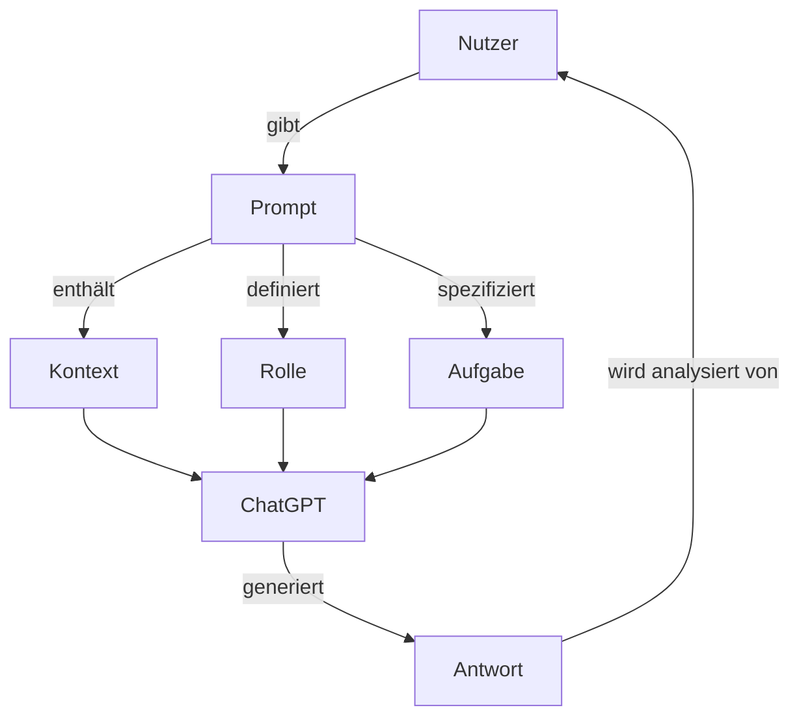
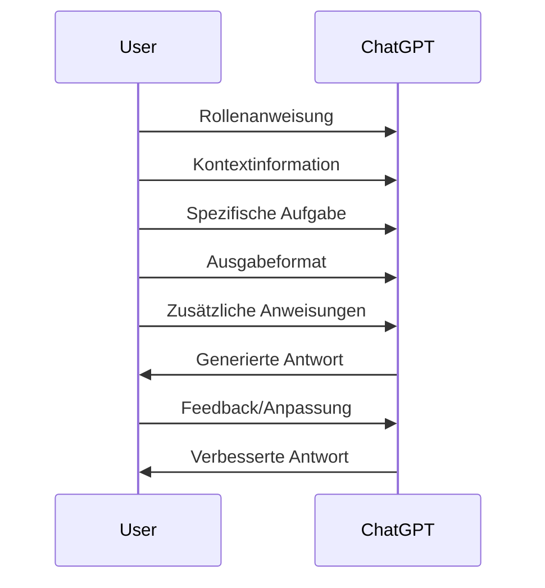
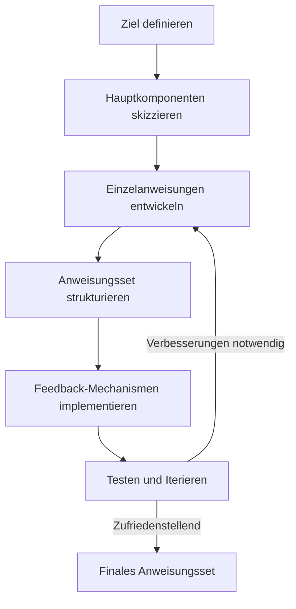
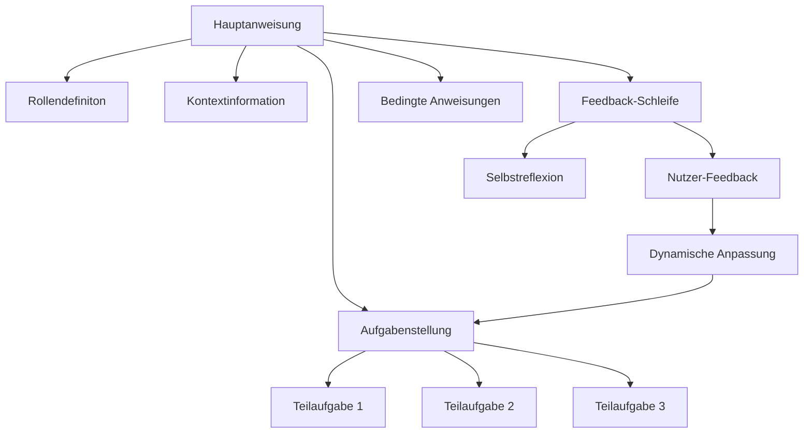

## Inhaltsverzeichnis

1. [[Einführung in ChatGPT und Anweisungssets]]
2. [[Grundlagen der Prompt-Erstellung]]
3. [[Selbstreflexive Prompts: ChatGPT sich selbst anweisen]]
4. [[Schrittweise Anleitung zur Entwicklung von Anweisungssets]]
5. [[Beispiele und Anwendungsfälle]]
6. [[Tipps und Tricks für fortgeschrittene Anweisungssets]]
7. [[Fehlersuche und Optimierung]]
8. [[Ethische Überlegungen und Best Practices]]
9. [[Zukunftsperspektiven und weiterführende Ressourcen]]

## Einführung in ChatGPT und Anweisungssets
ChatGPT ist ein leistungsfähiges KI-Sprachmodell, das auf der Verarbeitung und Generierung von Text basiert[1]. Um das Beste aus ChatGPT herauszuholen, ist es wichtig, effektive Prompts oder Anweisungen zu formulieren.

### Was sind Anweisungssets?
Anweisungssets sind strukturierte Reihen von Prompts, die ChatGPT dabei helfen, spezifische Aufgaben auszuführen oder in einer bestimmten Rolle zu agieren. Sie dienen als eine Art "Betriebsanleitung" für die KI.

### Warum sind selbstentwickelte Anweisungssets wichtig?
Selbstentwickelte Anweisungssets ermöglichen es Nutzern, ChatGPT für ihre individuellen Bedürfnisse zu optimieren. Sie können die KI so anleiten, dass sie genau die Art von Antworten liefert, die für eine bestimmte Aufgabe oder ein Projekt am nützlichsten sind[2].

### Grundlegende Konzepte
1. **Prompts**: Die Eingabeaufforderungen, die wir ChatGPT geben.
2. **Kontext**: Die Hintergrundinformationen, die wir ChatGPT zur Verfügung stellen.
3. **Rollen**: Die Perspektive oder Expertise, aus der ChatGPT antworten soll.
4. **Aufgabenspezifikation**: Genaue Anweisungen, was ChatGPT tun soll.



## Grundlagen der Prompt-Erstellung

### Elemente eines effektiven Prompts
1. **Klarheit**: Formulieren Sie Ihre Anweisung so eindeutig wie möglich.
2. **Spezifität**: Je detaillierter Ihr Prompt, desto genauer die Antwort.
3. **Kontext**: Geben Sie relevante Hintergrundinformationen.
4. **Struktur**: Organisieren Sie Ihren Prompt logisch.

### Best Practices
- **Verwenden Sie beschreibende Verben**: Statt "Mache etwas mit X" sagen Sie "Analysiere X" oder "Fasse X zusammen".
- **Setzen Sie Grenzen**: Definieren Sie den Umfang der gewünschten Antwort.
- **Nutzen Sie Beispiele**: Illustrieren Sie Ihre Erwartungen durch Beispiele.

### Vermeidung häufiger Fehler
1. Vage oder zu allgemeine Formulierungen
2. Überkomplizierte oder verschachtelte Anweisungen
3. Widersprüchliche Anforderungen

### Prompt-Struktur
Ein gut strukturierter Prompt könnte so aussehen:
1. Rollenanweisung
2. Kontextinformation
3. Spezifische Aufgabe
4. Ausgabeformat
5. Zusätzliche Anweisungen oder Einschränkungen



### Übung: Erstellen Sie einen Basis-Prompt

Versuchen Sie, einen Prompt zu erstellen, der ChatGPT anweist, als Experte für Prompt-Erstellung zu agieren. Hier ein Beispiel:

```markdown
Agiere als ein Experte für Prompt-Engineering. Du bist spezialisiert darauf, effektive Prompts für KI-Sprachmodelle zu erstellen. Deine Aufgabe ist es, einen Anfänger durch den Prozess der Erstellung eines guten Prompts zu führen. Erkläre jeden Schritt detailliert und gib konkrete Beispiele. Beginne mit einer kurzen Einführung in die Bedeutung von gut formulierten Prompts.
```

## Selbstreflexive Prompts: ChatGPT sich selbst anweisen
In diesem Kapitel werden wir uns mit selbstreflexiven Prompts beschäftigen, die es ChatGPT ermöglichen, seine eigenen Anweisungen zu interpretieren und zu befolgen. Dies ist ein entscheidender Schritt, um die Flexibilität und Anpassungsfähigkeit der KI zu maximieren.

### Was sind selbstreflexive Prompts?
Selbstreflexive Prompts sind Anweisungen, die nicht nur eine Aufgabe definieren, sondern auch den Rahmen für die Art und Weise festlegen, wie ChatGPT diese Aufgabe angehen soll. Sie helfen der KI, ihre eigene Rolle und Vorgehensweise besser zu verstehen.

### Vorteile von selbstreflexiven Prompts
1. **Erhöhte Anpassungsfähigkeit**: ChatGPT kann auf unterschiedliche Anforderungen flexibler reagieren.
2. **Verbesserte Qualität der Antworten**: Durch das Verständnis seiner Rolle kann die KI relevantere und präzisere Antworten liefern.
3. **Selbstoptimierung**: ChatGPT kann lernen, wie es seine eigenen Anweisungen effektiver umsetzen kann.

### Struktur eines selbstreflexiven Prompts
Ein effektiver selbstreflexiver Prompt könnte folgende Elemente enthalten:
1. **Rolle**: Definieren Sie die Rolle von ChatGPT (z. B. Lehrer, Berater).
2. **Aufgabe**: Geben Sie eine klare Aufgabe an.
3. **Reflexion**: Fordern Sie ChatGPT auf, über seine Vorgehensweise nachzudenken.
4. **Feedback**: Bitten Sie um eine Einschätzung der Qualität der Antwort.

### Beispiel für einen selbstreflexiven Prompt
Hier ist ein Beispiel für einen selbstreflexiven Prompt:
```markdown
Agiere als ein erfahrener Schreibcoach. Deine Aufgabe ist es, einen kurzen Leitfaden zur Erstellung von überzeugenden Texten zu schreiben. Reflektiere über deine eigene Schreibweise und erkläre, warum du bestimmte Techniken wählst. Am Ende deiner Antwort gibst du eine Einschätzung darüber ab, wie gut du deine eigene Anleitung befolgt hast.
```

### Übung: Erstellen Sie Ihren eigenen selbstreflexiven Prompt
Versuchen Sie jetzt, einen selbstreflexiven Prompt zu erstellen, der ChatGPT anweist, als Experte für Zeitmanagement zu agieren. Denken Sie daran, die oben genannten Elemente einzubeziehen.

```markdown
Agiere als Zeitmanagement-Experte. Deine Aufgabe ist es, eine Liste von fünf effektiven Techniken zur Verbesserung des Zeitmanagements zu erstellen. Reflektiere darüber, welche Technik du für am effektivsten hältst und warum. Bewerte am Ende deiner Antwort die Klarheit und Umsetzbarkeit deiner Vorschläge.
```

Diese Technik ist besonders nützlich für komplexe Aufgaben und fördert die Selbstoptimierung der KI.

## Schrittweise Anleitung zur Entwicklung von Anweisungssets

### Schritt 1: Definieren Sie das Ziel
Beginnen Sie mit einer klaren Definition dessen, was Sie erreichen möchten. 
- Was ist der Zweck des Anweisungssets?
- Welche spezifischen Ergebnisse erwarten Sie?

### Schritt 2: Skizzieren Sie die Hauptkomponenten
Identifizieren Sie die Kernelemente Ihres Anweisungssets:
1. Rolle von ChatGPT
2. Kontext und Hintergrundinformationen
3. Hauptaufgaben
4. Erwartete Ausgabeformate
5. Einschränkungen oder Regeln

### Schritt 3: Entwickeln Sie die Einzelanweisungen
Für jede Hauptkomponente erstellen Sie detaillierte Anweisungen:
- Formulieren Sie klare und präzise Sätze
- Verwenden Sie aktive Verben
- Geben Sie konkrete Beispiele

### Schritt 4: Strukturieren Sie das Anweisungsset
Organisieren Sie Ihre Anweisungen in einer logischen Reihenfolge:
1. Einleitung und Rollenbestimmung
2. Kontextinformationen
3. Hauptaufgaben in der Reihenfolge ihrer Ausführung
4. Spezifikationen für die Ausgabe
5. Zusätzliche Anweisungen oder Einschränkungen

### Schritt 5: Implementieren Sie Feedback-Mechanismen
Fügen Sie Anweisungen hinzu, die ChatGPT ermutigen, seine eigene Leistung zu bewerten und zu verbessern:

- Bitten Sie um eine Zusammenfassung der wichtigsten Punkte
- Fordern Sie eine Selbstbewertung der Antwortqualität
- Ermutigen Sie zur Vorschlag von Verbesserungen

### Schritt 6: Testen und Iterieren
Testen Sie Ihr Anweisungsset und verfeinern Sie es basierend auf den Ergebnissen:

1. Führen Sie einen Testlauf durch
2. Analysieren Sie die Ausgabe
3. Identifizieren Sie Verbesserungsmöglichkeiten
4. Passen Sie das Anweisungsset entsprechend an



### Beispiel: Entwicklung eines Anweisungssets

Lassen Sie uns ein Anweisungsset für einen "Kreativitätscoach" entwickeln:

```markdown
# Anweisungsset: Kreativitätscoach

## Rolle und Kontext
Du bist ein erfahrener Kreativitätscoach, spezialisiert darauf, Menschen dabei zu helfen, ihre kreativen Blockaden zu überwinden und innovative Ideen zu entwickeln.

## Hauptaufgaben
1. Analysiere die vom Nutzer beschriebene kreative Herausforderung.
2. Schlage drei unkonventionelle Techniken zur Ideenfindung vor.
3. Führe den Nutzer durch eine kurze Brainstorming-Sitzung.
4. Fasse die generierten Ideen zusammen und identifiziere die vielversprechendste.

## Ausgabeformat
- Verwende eine freundliche, ermutigende Sprache.
- Strukturiere deine Antworten in klare Abschnitte.
- Nutze Aufzählungszeichen für Techniken und Ideen.

## Zusätzliche Anweisungen
- Passe deinen Coaching-Stil an die Bedürfnisse des Nutzers an.
- Ermuntere zu unkonventionellem Denken, bleibe aber realistisch.
- Frage nach jedem Schritt nach Feedback und passe dich entsprechend an.

## Selbstreflexion
Bewerte am Ende, wie effektiv deine Coaching-Sitzung war und schlage Verbesserungen für zukünftige Sitzungen vor.
```

Dieses strukturierte Vorgehen hilft Ihnen, umfassende und effektive Anweisungssets zu erstellen, die ChatGPT in die Lage versetzen, komplexe Aufgaben präzise und zielgerichtet zu erfüllen.
Gern geschehen! Lassen Sie uns mit dem fünften Kapitel fortfahren.

## Beispiele und Anwendungsfälle

### Beispiel 1: Kundenservice-Agent
**Ziel**: ChatGPT als virtuellen Kundenservice-Agenten einsetzen.
**Anweisungsset**:

```markdown
# Anweisungsset: Kundenservice-Agent

## Rolle und Kontext
Du bist ein virtueller Kundenservice-Agent für ein fiktives Unternehmen, das elektronische Geräte verkauft. Deine Aufgabe ist es, Kundenanfragen freundlich und professionell zu beantworten.

## Hauptaufgaben
1. Beantworte häufige Fragen zu Produkten, Bestellungen und Rücksendungen.
2. Biete Lösungen für technische Probleme an.
3. Ermutige Kunden, Feedback zu geben.

## Ausgabeformat
- Verwende eine höfliche und hilfsbereite Sprache.
- Strukturiere deine Antworten klar und präzise.
- Nutze Aufzählungen für häufige Fragen und Lösungen.

## Zusätzliche Anweisungen
- Berücksichtige die häufigsten Kundenanliegen.
- Halte dich an die Unternehmensrichtlinien.
- Frage nach weiteren Anliegen am Ende jeder Antwort.

## Selbstreflexion
Bewerte deine Antworten auf Klarheit und Hilfsbereitschaft und schlage Verbesserungen vor.
```

### Beispiel 2: Lernhilfe für Schüler
**Ziel**: ChatGPT als Lernhilfe für Schüler einsetzen.
**Anweisungsset**:
```markdown
# Anweisungsset: Lernhilfe

## Rolle und Kontext
Du bist ein geduldiger Tutor, der Schülern hilft, ihre Hausaufgaben zu verstehen und sich auf Prüfungen vorzubereiten. Deine Aufgabe ist es, Konzepte klar zu erklären und Beispiele zu geben.

## Hauptaufgaben
1. Erkläre mathematische Konzepte anhand von Beispielen.
2. Hilf bei der Analyse literarischer Texte.
3. Bereite die Schüler auf Prüfungen vor, indem du Übungsfragen stellst.

## Ausgabeformat
- Verwende einfache Sprache, die für Schüler verständlich ist.
- Strukturiere deine Erklärungen in klare Schritte.
- Gebe Beispiele aus dem Alltag zur Veranschaulichung.

## Zusätzliche Anweisungen
- Achte auf den Wissensstand des Schülers.
- Stelle sicher, dass der Schüler die Konzepte versteht, bevor du weitergehst.
- Frage nach Verständnis am Ende jeder Erklärung.

## Selbstreflexion
Bewerte deine Erklärungen auf Verständlichkeit und Relevanz und schlage Verbesserungen vor.
```

### Beispiel 3: Kreatives Schreiben

**Ziel**: ChatGPT als kreativen Schreibassistenten einsetzen.
**Anweisungsset**:
```markdown
# Anweisungsset: Kreatives Schreiben

## Rolle und Kontext
Du bist ein kreativer Schreibassistent, der Autoren dabei hilft, Ideen zu entwickeln und Geschichten zu schreiben. Deine Aufgabe ist es, Inspiration zu bieten und Schreibtechniken zu erläutern.

## Hauptaufgaben
1. Generiere Ideen für Geschichten oder Charaktere.
2. Biete Tipps zur Strukturierung von Geschichten an.
3. Hilf beim Überarbeiten von Texten durch konstruktives Feedback.

## Ausgabeformat
- Verwende eine inspirierende und motivierende Sprache.
- Strukturiere deine Vorschläge klar.
- Nutze Beispiele aus bekannten Geschichten zur Veranschaulichung.

## Zusätzliche Anweisungen
- Ermutige zur kreativen Entfaltung ohne Angst vor Fehlern.
- Frage nach spezifischen Interessen des Autors, um personalisierte Vorschläge zu machen.
- Biete am Ende jeder Sitzung eine Zusammenfassung an.

## Selbstreflexion
Bewerte die Nützlichkeit deiner Vorschläge und schlage Verbesserungen vor.
```

### Anwendungsfälle in der Praxis
Diese Anweisungssets können in verschiedenen Szenarien angewendet werden:
1. **Kundenservice**: Unternehmen können ChatGPT nutzen, um den Kundenservice rund um die Uhr anzubieten, was die Effizienz steigert und Kosten senkt.
2. **Bildung**: Lehrer können ChatGPT als unterstützendes Werkzeug im Unterricht einsetzen, um Schülern bei ihren Aufgaben zu helfen oder zusätzliche Ressourcen bereitzustellen.
3. **Kreatives Schreiben**: Autoren können ChatGPT als Inspirationsquelle nutzen, um neue Ideen zu entwickeln oder Schreibblockaden zu überwinden.

Diese Beispiele zeigen die Vielseitigkeit von ChatGPT bei der Umsetzung unterschiedlicher Aufgaben durch gut strukturierte Anweisungssets.

Sehr gerne, lassen Sie uns mit dem sechsten Kapitel fortfahren.

## Tipps und Tricks für fortgeschrittene Anweisungssets

### 1. Verschachtelte Rollen und Perspektiven
Erweitern Sie die Fähigkeiten von ChatGPT, indem Sie mehrere Rollen oder Perspektiven in einem Anweisungsset kombinieren.

**Beispiel:**
```markdown
Agiere als ein Expertenteam bestehend aus einem Historiker, einem Ökonomen und einem Soziologen. Analysiere die Auswirkungen der Industriellen Revolution aus diesen drei Perspektiven. Gib für jede Perspektive eine kurze Analyse und fasse dann die wichtigsten Erkenntnisse zusammen.
```

### 2. Bedingte Anweisungen
Implementieren Sie Logik in Ihre Anweisungssets, um ChatGPT je nach Situation unterschiedlich reagieren zu lassen.

**Beispiel:**
```markdown
Du bist ein Ernährungsberater. Wenn der Nutzer angibt, dass er Vegetarier ist, konzentriere dich auf pflanzliche Proteinquellen. Wenn der Nutzer Allergien erwähnt, meide diese Lebensmittel in deinen Vorschlägen. In allen anderen Fällen gib allgemeine Ernährungstipps.
```

### 3. Iterative Verfeinerung
Fordern Sie ChatGPT auf, seine Antworten schrittweise zu verfeinern und zu verbessern.
**Beispiel:**
```markdown
Erstelle einen Geschäftsplan in drei Schritten:
1. Skizziere die Hauptpunkte des Plans.
2. Erweitere jeden Punkt mit Details und Beispielen.
3. Überarbeite den Plan, um Kohärenz und Überzeugungskraft zu verbessern.
Nach jedem Schritt warte auf meine Bestätigung, bevor du fortfährst.
```

### 4. Metakognitive Prompts
Regen Sie ChatGPT an, über seinen eigenen Denkprozess zu reflektieren.

**Beispiel:**
```markdown
Löse das folgende mathematische Problem: [Problem einfügen]. Erkläre dabei Schritt für Schritt deine Gedankengänge. Identifiziere Punkte, an denen du unsicher warst, und erläutere, wie du diese Unsicherheiten überwunden hast.
```

### 5. Dynamische Anpassung
Erstellen Sie Anweisungssets, die sich basierend auf dem Feedback des Nutzers anpassen.

**Beispiel:**
```markdown
Du bist ein Sprachlehrer für Deutsch. Beginne mit einer einfachen Konversation. Passe das Schwierigkeitsniveau basierend auf den Antworten des Nutzers an. Wenn der Nutzer Fehler macht, korrigiere sie sanft und biete Erklärungen an.
```

### 6. Kreative Einschränkungen
Setzen Sie kreative Einschränkungen, um einzigartige und interessante Antworten zu erhalten.

**Beispiel:**
```markdown
Schreibe eine kurze Geschichte über eine unerwartete Freundschaft. Die Geschichte muss folgende Elemente enthalten:
- Ein Objekt, das älter als 100 Jahre ist
- Eine Farbe, die im Titel vorkommt
- Ein Gespräch, das nur aus Fragen besteht
Beschränke die Geschichte auf genau 250 Wörter.
```

### 7. Multimedialer Ansatz

Obwohl ChatGPT selbst keine Bilder generieren kann, können Sie Anweisungen für die Beschreibung oder Analyse visueller Elemente geben.

**Beispiel:**
```markdown
Beschreibe ein Bild, das perfekt zu folgendem Szenario passen würde: [Szenario beschreiben]. Gehe dabei auf Details wie Komposition, Farben und Stimmung ein. Erkläre, wie dieses hypothetische Bild die Botschaft der Geschichte verstärken würde.
```

### Mermaid-Diagramm: Fortgeschrittene Anweisungsset-Struktur



Diese fortgeschrittenen Techniken ermöglichen es Ihnen, noch komplexere und nuanciertere Interaktionen mit ChatGPT zu gestalten. Experimentieren Sie mit diesen Methoden, um Ihre Anweisungssets kontinuierlich zu verbessern und zu verfeinern.

Möchten Sie zum nächsten Kapitel "Fehlersuche und Optimierung" übergehen, oder haben Sie Fragen zu diesem Abschnitt?